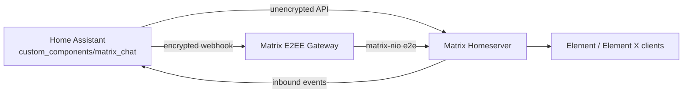

# Matrix Chat for Home Assistant

Production-ready Home Assistant custom integration for Matrix messaging with optional encrypted delivery gateway.

This project is built to replace Telegram-style automations with Matrix-native flows, including direct messages, room messaging, media delivery, retries, inbound commands, and operations tooling.

## Final status

Current release baseline: **v4.3** (with post-v3.5 hardening fixes)

Implemented and validated:

- Text messaging to Matrix users and rooms.
- Media messaging (image, video, file) with Element X compatible payloads.
- Reply, edit, and reaction support.
- Silent messaging (`m.notice`) to reduce push noise where supported.
- Event redaction/delete support (`matrix_chat.redact_event`).
- Thread messaging support for text and media (`thread_root_event_id`).
- `notify.matrix_chat` service for Telegram-like notify workflows.
- Encrypted gateway support for E2EE rooms and DMs.
- Inbound webhook + optional `!ha` command dispatch with strict allowlists.
- Outbound retry queue and manual flush.
- Room/user helper services (`resolve_target`, `list_rooms`, `join_room`, `invite_user`, `ensure_dm`, `ensure_room_encrypted`).
- Device key publication hardening in gateway startup.
- Cross-signing and device-signing runbook for Element X trust-shield warnings.

## Architecture



### When the gateway is used

- Unencrypted rooms: HA sends directly to Matrix APIs.
- Encrypted rooms (and encrypted DMs): HA can route sends through the gateway.
- Gateway keeps persistent crypto store in `encrypted_gateway/data/store`.

## Repository layout

- `custom_components/matrix_chat/` - Home Assistant integration.
- `encrypted_gateway/` - optional E2EE gateway service.
- `docs/HOWTO.md` - end-user setup and examples.
- `docs/DEVELOPER_GUIDE.md` - implementation and internals.
- `docs/OPERATIONS_AND_LESSONS.md` - operations runbooks and troubleshooting history.
- `wiki/` - GitHub wiki page sources (home, quick start, deep dive, troubleshooting).
- `VALIDATION_REPORT_2026-02-15.md` - staged validation evidence.

## Installation

## 1) Install integration files

Copy:

- `custom_components/matrix_chat`

into your HA config directory under:

- `/config/custom_components/matrix_chat`

Restart Home Assistant.

## 2) Configure Matrix Chat

Use UI flow (`Settings -> Devices & Services -> Add Integration -> Matrix Chat`) or YAML import.

Minimum config fields:

- `homeserver`
- `user_id`
- one auth method: `password` or `access_token`

Optional but recommended for encrypted rooms:

- `encrypted_webhook_url`
- `encrypted_webhook_token`
- `dm_encrypted: true`

See full examples in `docs/HOWTO.md`.

## 3) Optional: start encrypted gateway

```bash
cd encrypted_gateway
cp .env.example .env
# fill env values
mkdir -p data/store
docker compose up -d --build
curl -fsS http://127.0.0.1:18081/health
```

## Available Home Assistant services

Main services:

- `matrix_chat.send_message`
- `matrix_chat.send_media`
- `matrix_chat.send_reaction`
- `matrix_chat.redact_event`
- `matrix_chat.get_inbound_config`
- `matrix_chat.get_outbox_stats`
- `matrix_chat.flush_outbox`
- `matrix_chat.resolve_target`
- `matrix_chat.list_rooms`
- `matrix_chat.join_room`
- `matrix_chat.invite_user`
- `matrix_chat.ensure_dm`
- `matrix_chat.ensure_room_encrypted`

Notify platform:

- `notify.matrix_chat`

Detailed service fields and examples: `docs/HOWTO.md`.

## Security model

- Never commit `.env`, access tokens, passwords, or HA `secrets.yaml` values.
- Keep inbound commands disabled unless allowlists are explicitly configured.
- Restrict command allowlists for:
  - sender IDs
  - room IDs
  - allowed `domain.service` patterns
- Keep encrypted gateway internal-only; do not expose it publicly.

## Known production pitfalls

### 1) Element X media compatibility

For encrypted media events, clients expect encrypted `file` payload and no invalid schema mixing.

### 2) `Encrypted by an unknown or deleted device`

Usually old events signed by removed devices. Restore legacy device keys if historical timeline needs to render cleanly.

### 3) `Encrypted by a device not verified by its owner`

Cross-signing issue. The bot user needs:

- `master_keys`
- `self_signing_keys`
- device signatures from self-signing key

If using Cloudflare, key-write endpoints can be blocked (`1010`); use local Synapse endpoint for cross-signing writes.

### 4) `M_UNKNOWN_TOKEN` from Matrix APIs

Token rotation mismatch between stored access token and active Matrix session. Re-auth and update HA secret/entry token.

## Development and contribution

Start with:

- `docs/DEVELOPER_GUIDE.md`

For operations and troubleshooting:

- `docs/OPERATIONS_AND_LESSONS.md`

## License

No explicit license file is included yet. Add one before broader public distribution.
