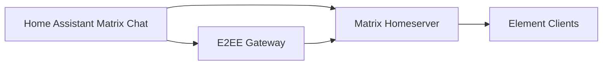

# Matrix Chat HA Wiki

Welcome to the Matrix Chat Home Assistant wiki.

This wiki is designed for fast onboarding and deep technical reference.

## Start here

- [Quick Start](Quick-Start)
- [How To Examples](How-To-Examples)
- [Developer Deep Dive](Developer-Deep-Dive)
- [Operations and Lessons Learned](Operations-and-Lessons-Learned)
- [Troubleshooting](Troubleshooting)

## What this integration can do

- Send text to users and rooms.
- Send image/video/file media.
- Reply, edit, react to Matrix events.
- Use `notify.matrix_chat` as a Telegram-style notify channel.
- Route encrypted sends through the E2EE gateway.
- Process inbound Matrix events and optional allowlisted `!ha` commands.
- Recover from outages with an outbound retry queue.
- Manage room/user workflows with helper services.

## Core architecture

## Security reminders

- Never commit tokens or passwords.
- Keep command allowlists strict.
- Keep gateway internal-only.
- For cross-signing key writes, use local Synapse endpoint if Cloudflare blocks writes.
